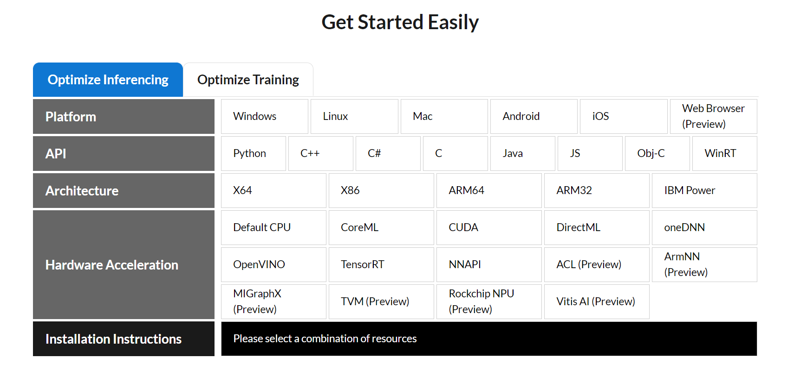

# How to convert old keras models to new tensorflow 
The CountNet repository contains `h5` models saved with `keras 2.3.1`. I have encountered some issues when loading these models using `tf.keras.models.load_model` or `tf.compat.v1.models.load_model`, especially the error :
```python
('Keyword argument not understood:', 'input_dtype')
```
Then I went to the docker image (see `Dockerfile`, `env.yml` and `requirements.txt` in CountNet repository) and ran the following script to save the model configuration as a json file and also as a ONNX model :
```python
import numpy as np
import soundfile as sf
import argparse
import os
import keras
import sklearn
import librosa
from keras import backend as K

#ONNX
import keras2onnx

eps = np.finfo(np.float).eps
def class_mae(y_true, y_pred):
    return K.mean(
        K.abs(K.argmax(y_pred, axis=-1) - K.argmax(y_true, axis=-1)),
        axis=-1
    )
model_name = "CRNN"
# load model
model = keras.models.load_model(
    os.path.join(model_name + '.h5'),
    custom_objects={'class_mae': class_mae,'exp': K.exp}
)
# print model summary
print(model.summary())
# save model configuration
json_config = model.to_json()
with open(model_name+'_config.json', 'w') as json_file:
    json_file.write(json_config)

print("Keras version :",keras.__version__)
# convert to onnx model
onnx_model = keras2onnx.convert_keras(model, model_name)
#Save
keras2onnx.save_model(onnx_model, model_name+"_ONNX.onnx")
```
Then I downloaded those json configuration and put them in my system in the `json_config` directory.
Then I just ran the script `convert_models.py`. 
```bash
$ python convert_models.py
```

### Onnx compatibility

